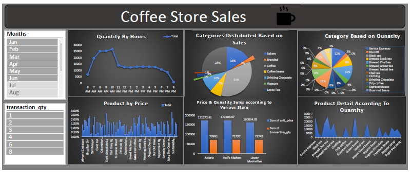

# ☕ Coffee Shop Sales Analysis Dashboard (MS Excel)

## 📌 Project Overview
This project analyzes coffee shop sales data to identify revenue trends, top-performing products, and customer purchase behavior using Microsoft Excel.

The goal was to transform raw transactional data into meaningful business insights using Pivot Tables, Charts, and KPI metrics.

---

## 🎯 Business Problem
The coffee shop wanted to:
- Track daily and monthly revenue
- Identify top-selling products
- Analyze peak sales hours
- Understand category-wise performance

---

## 🗂 Dataset Details
The dataset includes:
- Order ID
- Order Date
- Product Category
- Product Name
- Quantity Sold
- Unit Price
- Total Sales

---

## 🛠 Tools & Techniques Used
- Pivot Tables
- Pivot Charts
- Data Cleaning
- Conditional Formatting
- KPI Cards
- Slicers for Dynamic Filtering

---

## 📊 Dashboard Features
- Total Revenue KPI
- Total Orders KPI
- Best Selling Product
- Category-wise Revenue Breakdown
- Monthly Sales Trend
- Hourly Sales Analysis

---

## 🔍 Key Insights
- Weekend sales were significantly higher than weekdays.
- Beverages contributed the highest revenue share.
- Peak sales time was between 5 PM – 8 PM.
- A small number of products generated majority revenue (Pareto principle observed).

---

## Dashboard Preview

---

## 📈 Business Impact
This dashboard helps management:
- Optimize inventory planning
- Improve promotional strategies
- Identify peak business hours
- Focus on high-performing products

---

## 👨‍💻 Author
Faraz Niyazi  
Data Analyst | Excel | SQL | Power BI

