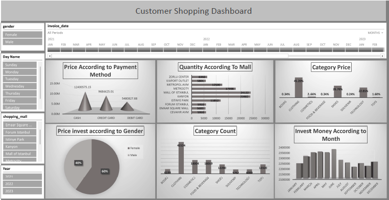

# 🛒 Customer Shopping Analysis Dashboard (MS Excel)

## 📌 Project Overview
This project analyzes customer shopping behavior to understand purchasing patterns, spending trends, and product performance using Excel.

The dashboard converts raw transactional data into business-driven insights for decision-making.

---

## 🎯 Business Objective
The company wanted to:
- Track customer purchase frequency
- Identify high-value customers
- Analyze product-wise revenue
- Monitor overall sales performance

---

## 🗂 Dataset Details
The dataset contains:
- Customer ID
- Order Date
- Product Name
- Category
- Quantity
- Price
- Total Amount

---

## 🛠 Tools & Techniques Used
- Data Cleaning
- Pivot Tables
- Advanced Excel Formulas
- Conditional Formatting
- Interactive Slicers
- Revenue & Customer KPIs

---

## 📊 Dashboard Features
- Total Revenue
- Total Customers
- Average Order Value
- Top 10 Customers by Revenue
- Category-wise Sales Distribution
- Monthly Sales Trend

---

## 🔍 Key Insights
- 20% of customers generated nearly 60% of total revenue.
- Seasonal variation observed in sales trends.
- Certain product categories consistently outperform others.
- Repeat customers significantly contribute to overall revenue.

---

## 📷 Dashboard Preview

---

## 📈 Business Value
This dashboard enables:
- Customer segmentation
- Loyalty strategy planning
- Revenue optimization
- Better marketing targeting

---

## 👨‍💻 Author
Faraz Niyazi  
Data Analyst | Excel | SQL | Power BI
