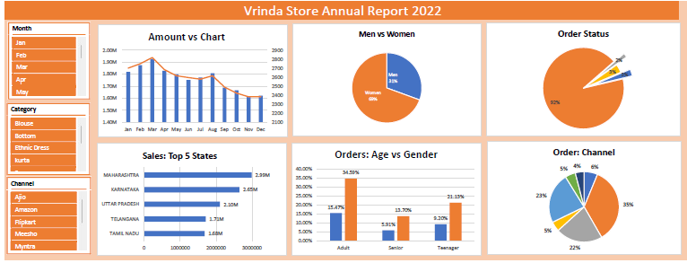

# 🏬 Vrinda Store Sales Dashboard (MS Excel)

## 📌 Project Overview
This project analyzes retail sales data of Vrinda Store to monitor revenue, orders, and product performance using Excel dashboard techniques.

The goal was to create a dynamic, interactive sales dashboard for business monitoring.

---

## 🎯 Business Problem
The store management wanted to:
- Track monthly sales performance
- Identify top-performing states
- Analyze gender-based sales distribution
- Understand category contribution

---

## 🗂 Dataset Details
The dataset includes:
- Order ID
- Order Date
- State
- Gender
- Product Category
- Sales Amount
- Order Status

---

## 🛠 Tools Used
- Pivot Tables
- Pivot Charts
- Slicers
- Data Cleaning
- Conditional Formatting
- Dashboard Design Techniques

---

## 📊 Dashboard Components
- Total Sales KPI
- Total Orders KPI
- Sales by State
- Sales by Gender
- Category Contribution
- Monthly Sales Trend

---

## 🔍 Key Insights
- Majority revenue generated from specific top-performing states.
- Female customers contributed higher overall sales.
- Clothing category dominated revenue share.
- Seasonal spikes observed in certain months.

---

## 📷 Dashboard Preview

---

## 📈 Business Impact
This dashboard helps:
- Track performance in real-time
- Identify growth opportunities
- Optimize product strategy
- Improve regional marketing focus

---

## 👨‍💻 Author
Faraz Niyazi  
Data Analyst | Excel | SQL | Power BI
